# Sprite Diffusion Research

Research pipeline for turning a text description into a pixel-ish animated
sprite. The repository deliberately treats acquisition, provenance,
normalization, and evaluation as part of the model rather than as disposable
preprocessing.

**[Visual study gallery](docs/STUDY_GALLERY.md)** ·
**[Weight release guide](docs/WEIGHTS_RELEASE.md)** ·
**[Exact weight manifest](releases/best-weights-v1.json)** ·
**[Dataset backup contract](docs/DATASET_BACKUP.md)**

The initial target is a transparent 64x64 RGBA, eight-frame animation. The
fast baseline is an image-first diffusion pipeline; the main research target
is a compact native-pixel spatiotemporal diffusion transformer.

## Current proof-of-concept status

The repository now has an executable pixel-space PixelDiT/rectified-flow path,
factorized text/entity/action/view/direction/loop conditioning, hash-verified
checkpoint-only inference, exact-target evaluation, animated preview export, and
hard-alpha calibration. A 48-clip overfit experiment and its safe 1,000-to-3,000-step
continuation demonstrate in-sample action-token sensitivity under matched noise.
The continuation materially reduces exact-target pixel and alpha error, but visible
outputs remain noisy and identity/action reproduction is not yet reliable. This is a
memorization result, not evidence of novel text-to-sprite generation. See
`docs/EXPERIMENTS.md` for exact artifact hashes, limitations, and causal controls.
A hash-linked hard-alpha/palette preview bundle makes the current outputs easier
to inspect without replacing their canonical raw arrays: eight colors preserves
more form than two, but detached-pixel noise and weak action identity remain.

The live provenance index now also contains an exact, rights-filtered TMWA
one-layer monster projection. Its 540 action-known, model-ready multi-frame clips
cover animal, monster, humanoid, and object identities across attack, walk, idle,
spawn, cast, and hurt. A target-distinct bounded training design is being prepared;
it does not inherit the false action-alias contrasts found and fixed in Widelands.

One later 48-clip experiment is explicitly quarantined as a data-pipeline
diagnostic: its Open Surge inputs were materialized before the engine's exact
magenta transparency key was implemented. Open Surge projection v2 now records and
executes that transform with engine-source evidence. Old artifacts are preserved,
not overwritten, and must not be used for appearance or alpha-quality claims.

## Experiment progression — visible results

The images below are part of this repository, not remote screenshots. Most motion
examples are animated PNGs; open an image directly if a Markdown renderer displays
only frame zero. **Target** means source supervision. **Generated** means model
output. **In-sample** means the character/action was present in training; **held-out**
means the character identity was excluded from training.

### 1. Small direct-pixel DiTs: prove the training loop

The first models worked directly in RGBA pixel space. Fetid Rat showed that the
network could replay four actions when trained on one identity. The 48-clip model
then exposed the limitation: it reduced pixel error but produced noisy, weakly
identified sprites. These are memorization checks, not general generators.

| Fetid Rat target | Fetid Rat generated | 48-clip target | 48-clip generated |
|---|---|---|---|
| 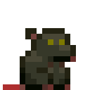 | 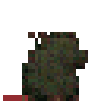 | 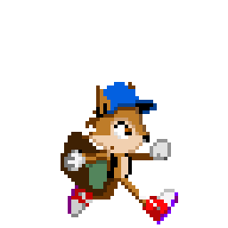 | 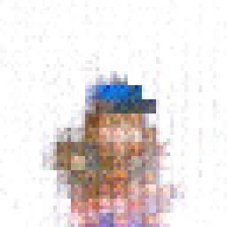 |

### 2. Causal action tests: does the verb actually matter?

TMWA Causal16 used matched noise and paired idle/walk examples so changing the
action token was measurable. It improved from 1,000 to 2,000 steps, but remained an
in-sample test. The broad semantic model then evaluated identity-disjoint characters:
it learned rough action/shape cues but not production-quality identity detail.

| Exact target | 1,000 steps | 2,000 steps | Broad held-out target | Broad held-out output |
|---|---|---|---|---|
|  | 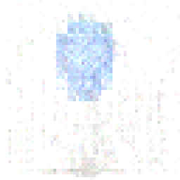 | 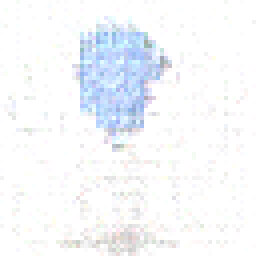 | 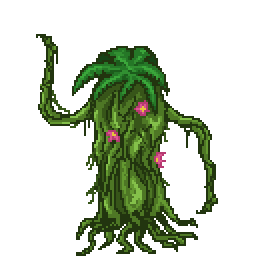 | 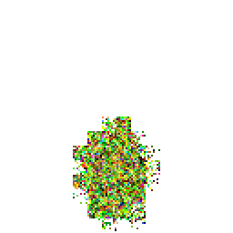 |

The broad rectified-flow control did not fix this and is retained as a rejected
control rather than omitted from the record:

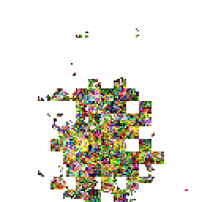

### 3. MUGEN establishes a dense six-action schema

MUGEN changed the data problem. Its conventional action numbers let the corpus align
`idle`, `walk`, `jump`, `block`, `attack_a`, and `attack_b` across thousands of
characters instead of treating unrelated clips as one loose animation bucket. A
small latent classifier confirms that action information is present on completely
held-out character identities; the two attack classes are the main confusion pair.

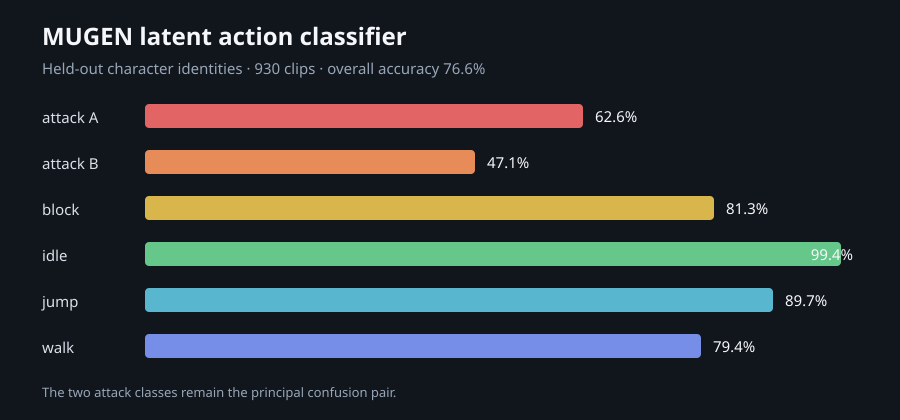

### 4. Large pretrained controls versus a compact latent route

An SD 1.4 image LoRA and AnimateDiff temporal LoRA were tested as historical
controls. They provided stronger priors but depend on large separately obtained base
models and are not the desired consumer-scale architecture. The compact 2x RGBA
autoencoder instead defines the detail ceiling for scratch-trained latent models.

| SD 1.4 held-out still | AnimateDiff target | AnimateDiff generated | Compact codec reconstruction |
|---|---|---|---|
| 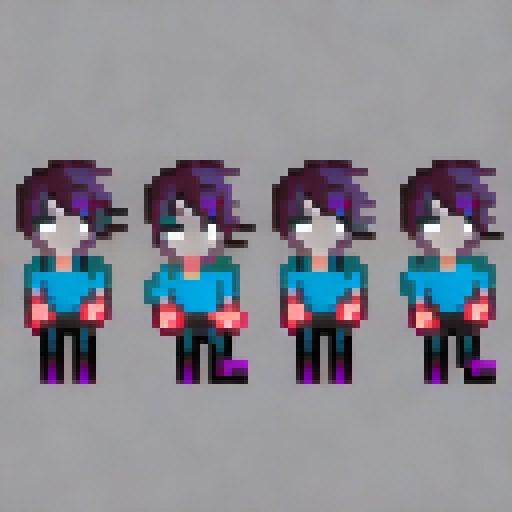 | 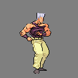 | 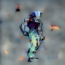 | 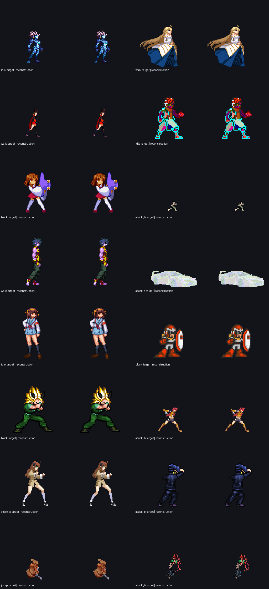 |

### 5. Reference-conditioned latent motion

With one reference character, latent motion plus pixel refinement nearly reaches the
codec ceiling. That good-looking result is in-sample. Scaling the same idea to many
identities shows the real problem: the model recognizes the subject and action but
averages away fine pose and identity details. A denser scratch run exhibits the same
failure mode.

| One-character target | One-character generated | Broad target | Broad generated |
|---|---|---|---|
|  | 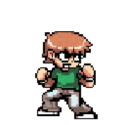 | 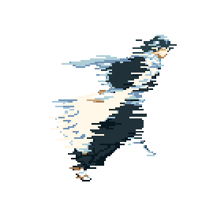 | 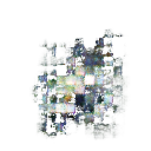 |

| Dense six-action target | Dense six-action generated |
|---|---|
| 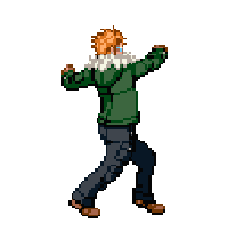 | 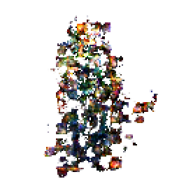 |

### 6. Decompose generation into still, keypose, and trajectory

The current direction separates three jobs: text-to-starting-sprite, reference plus
verb to peak action pose, then start/peak/start anchors plus the verb to a complete
loop. Fixed-middle DiT and identity U-Net studies isolate Stage 2. The anchored model
tests Stage 3. This makes an averaging failure local and measurable instead of asking
one network to discover appearance, pose, and time simultaneously.

| Fixed-middle keypose DiT | Identity-conditioned keypose U-Net |
|---|---|
| 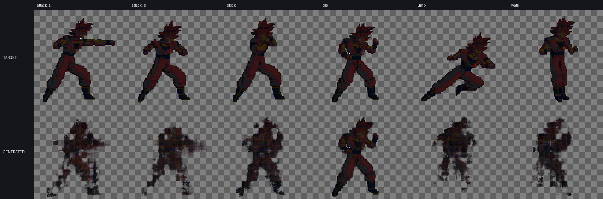 | 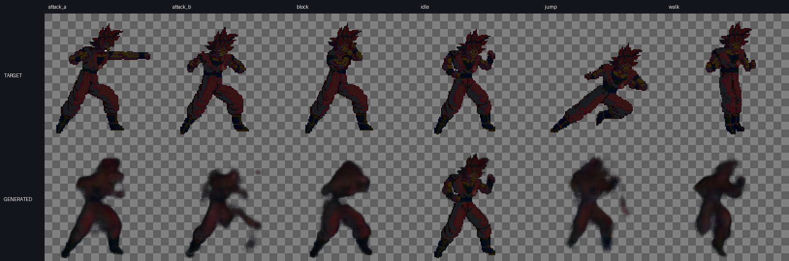 |

| Anchored trajectory target | Anchored trajectory generated |
|---|---|
| 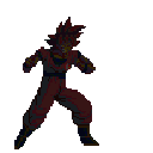 | 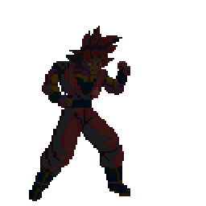 |

### 7. Broad still-image model and crash-safe continuation

The broad still-image DiT is the active scratch-trained image stage. This preview is
from step 20,000 in the same line; the release preserves the later step-45,000 EMA
and step-47,500 crash-resume state. The visual is deliberately labeled with its real
step instead of being presented as a later render.

| Broad still target | Generated at step 20,000 |
|---|---|
| 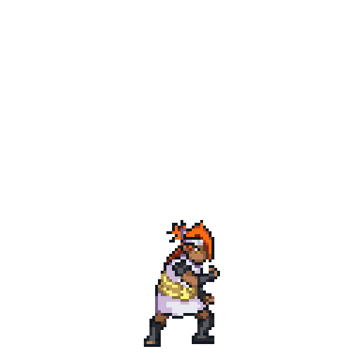 | 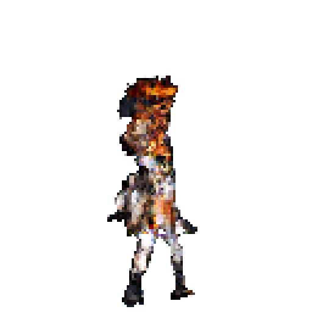 |

The complete per-study notes and weight mapping remain in
[`docs/STUDY_GALLERY.md`](docs/STUDY_GALLERY.md), while exact checkpoint names,
sizes, and SHA-256 values are in
[`releases/best-weights-v1.json`](releases/best-weights-v1.json).

## Non-negotiable invariants

- Raw downloads are immutable and addressed by SHA-256.
- Every derived frame retains a machine-readable path back to its carrier URL,
  asset page, archive member, extraction parameters, and acquisition time.
- Discovery, rights observations, quality, and training membership are
  separate facts. Ambiguous material remains indexed rather than disappearing.
- Dataset splits group by source pack, character, and near-duplicate cluster.
- Image resampling never silently introduces bilinear filtering.
- Acquisition stops before the configured free-space floor. The default floor
  is **100 GiB free on the volume containing the data root**.

## Bootstrap

```powershell
cd C:\Users\forre\Documents\sprite-diffusion-research
python -m venv .venv
.venv\Scripts\python -m pip install -e ".[dev]"
.venv\Scripts\spritelab init
.venv\Scripts\spritelab status
```

Configuration lives in `configs/default.toml`. Local paths and credentials can
be supplied with environment variables or an untracked `config.local.toml`.

## Planned data flow

```text
discover -> snapshot metadata -> retrieve -> hash/store -> unpack/decode
         -> identify sheets/sequences -> normalize -> deduplicate -> caption
         -> grouped split -> dataset snapshot -> train/evaluate
```

See `docs/` for the evolving architecture and corpus notes.

## Reproducible dataset snapshots

The default export selects only clips with complete positive frame timing and uses
identity/blob/duplicate-aware components with deterministic balanced splits:

```powershell
.venv\Scripts\spritelab dataset export `
  data\index\snapshots\temporal-v2.json `
  --seed temporal-v2
```

Pose projections with unknown timing remain useful for spatial action conditioning, but must
be opted into explicitly:

```powershell
.venv\Scripts\spritelab dataset export `
  data\index\snapshots\spatial-action-v1.json `
  --seed spatial-action-v1 `
  --minimum-frame-count 1 `
  --temporal-mode all
```

Existing snapshot paths are preserved unless `--overwrite` is supplied. See
`docs/DATASET_SNAPSHOTS.md` for the complete temporal-evidence and leakage contracts.
Known frame durations do not imply known loop semantics. A temporal snapshot can
therefore be provenance-valid and materializable while still being rejected by the
current fixed-phase training loader. Keep such clips as temporal evidence rather
than inventing loop labels or frame phases; select a model-ready source stratum or
add an explicit conditioning policy before training it.

The Universal LPC layer inventory is exported separately because each PNG is a modular
compositing layer rather than a complete entity. The compressed JSONL retains exact lazy crop
rectangles and member-level credit matches without materializing millions of derivative frames:

```powershell
.venv\Scripts\spritelab corpus lpc-manifest `
  58a80830f1ca065f40e6d6acd678cc44551dc8902690798de7be8689d468da5b `
  data\index\manifests\lpc-v1.jsonl.gz
```

## Model-ready clip materialization

Canonical snapshots can be converted to hash-verified RGBA NumPy clips without
silent downscaling or temporal interpolation:

```python
from pathlib import Path

from spritelab.materialize import materialize_snapshot
from spritelab.storage import DiskGuard

materialize_snapshot(
    Path("data/index/snapshots/temporal-v2-balanced.json"),
    Path("data/processed/temporal-v2-balanced"),
    disk_guard=DiskGuard(Path("C:/"), 100 * 1024**3),
)
```

The same operation is available as a guarded command:

```powershell
.venv\Scripts\spritelab dataset materialize `
  data\index\snapshots\temporal-v5-action-known.json `
  data\processed\temporal-v5-action-known `
  --bucket 32 --bucket 64 --bucket 128 --bucket 256 --bucket 512
```

Versioned local materializations cover multiple indexed corpora and lossless
32/64/128/256/512-pixel buckets. `spritelab.training_data` verifies every file and
array digest, converts straight RGBA to premultiplied channel-first model tensors,
and uses `spritelab.temporal` when an explicit fixed frame count is required. See
`docs/MATERIALIZATION.md` and `docs/MODEL_ARCHITECTURE.md` for the full contracts.

Pinned source-code corpora have rerunnable projections after their archives and
media are indexed:

```powershell
.venv\Scripts\spritelab corpus shattered-pixel-dungeon `
  deed31527c24b2a500f6c79e1cf2502c4c9d8b4391529033da7015cd73c97544
.venv\Scripts\spritelab corpus opensurge `
  1448d51c3e8bc8122ae893aad96e73f9c9ef1ffb74457109fa8cfa0ef10d0206
.venv\Scripts\spritelab corpus wesnoth `
  fd10c38abfe3406fbc1e4dfdbc03762c576e5c9376173a7f09120040cbccba3e
.venv\Scripts\spritelab corpus flare `
  9c8e58bb704f55174928990a1a375c213ffb2847d7b928d6117a84db3e1215cc
.venv\Scripts\spritelab corpus widelands `
  51093e130b2f4098716bc442ce3d8566d94b4590cfa233ba1c74e5d173a48186
.venv\Scripts\spritelab corpus ss14 `
  125ca78d04a4f522e04597bf49d49fdb67a8cd2c2d079be13a2b3edb5591c444
.venv\Scripts\spritelab corpus tmwa `
  7b7a8c61eca284b35ddedaa1af4210a1694933e36ebdc4299bd73395a6532152
```
