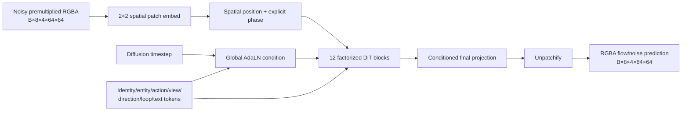

# Native-RGBA Sprite PixelDiT Architecture

Status: proof-of-concept scaffold, not a trained checkpoint or complete training system.

## Outcome and scope

The research target is a text-steerable model that emits an eight-frame, looping or
one-shot sprite clip at native 64×64 RGBA resolution. It must support more than
humanoid characters: animals, monsters, vehicles, props, effects, projectiles, and
environmental elements are first-class entity classes. Motion must likewise be
explicitly steerable rather than inferred only from prose: identity, entity, action,
view, direction, loop mode, and per-frame phase are separate conditions.

The implementation under `src/spritelab/models` establishes the smallest useful
contract for that experiment:

- a torch-free, validated configuration and metadata schema;
- a native-RGBA patch embedding and reconstruction path;
- factorized spatial and temporal self-attention;
- cross-attention to precomputed structured/text context tokens;
- diffusion-timestep conditioning through adaptive layer normalization;
- explicit continuous phase input with Fourier features; and
- deterministic UTF-8 prompt tokenization plus a small trainable structured/text
  encoder for end-to-end proof-of-concept runs;
- a tested rectified-flow training path, clean-sample reconstruction, and backward
  Euler sampler; and
- import-safe behavior when PyTorch is not installed.

The initial byte-level encoder remains an executable plumbing baseline and is not
expected to generalize language from a tiny sprite corpus. The next controlled path is
now implemented separately: a frozen, hash-bound CLIP text projection is fused into
the description-summary token while categorical action/view/direction/loop channels
remain independent. `spritelab.semantic_text` binds the exact local encoder snapshot,
tokenizer, input strings, and every embedding row; `SemanticSpriteConditionEncoder`
adds only a trainable projection/fusion layer. This does not yet provide unrestricted
text inference: a semantic checkpoint accepts only descriptions present in its
verified embedding table unless a separately pinned local encoder is invoked.

`spritelab.broad_train` also adds the first identity-disjoint minibatch runner. It
normalizes materialized clips by an explicit nearest-neighbor coordinate contract,
samples identities and actions hierarchically, trains ordinary rectified-flow and
direct endpoint objectives, tracks EMA weights, uses fixed validation noise, and
publishes immutable periodic resume checkpoints. It still does **not** include a
reference-image encoder or a production serving stack.

## Superseded initial native-pixel decision

Ordinary latent video diffusion is optimized for hundreds of pixels and natural
motion. Its spatial/temporal VAE can merge one-pixel details, soften alpha boundaries,
or interpolate poses that should remain discrete. At 64×64, the compute saved by a
VAE is less compelling, while reconstruction loss is proportionally more damaging.

The first scaffold predicted the flow/noise target directly over premultiplied
RGBA. This followed the motivation of
[PixelDiT](https://github.com/NVlabs/PixelDiT), whose patch-level and pixel-level
design avoids a fixed lossy autoencoder. The temporal factorization follows the
general design space explored by [Latte](https://github.com/Vchitect/Latte).

This does not assert that a custom DiT will beat a pretrained U-Net immediately. The
recommended experimental baseline remains an image-first, reference-conditioned
animator based on the staged result in
[Sprite Sheet Diffusion](https://arxiv.org/html/2412.03685v2) and the temporal-module
strategy in [AnimateDiff](https://github.com/guoyww/AnimateDiff). The direct-pixel
MUGEN run later demonstrated that this choice is not the quality path at 128x128x8:
ordinary validation flow improved while direct endpoint validation plateaued and
held-out samples remained noisy. That result supersedes the initial preference.

## Quality-first latent two-stage architecture (2026-08-13)

The active design separates appearance generation from motion:

1. detailed visual text generates one canonical RGBA sprite still;
2. the still, structured action tuple, and optional motion text generate latent
   animation residuals; and
3. the frozen sprite decoder reconstructs all ordered RGBA frames.

The still target is exactly one idle temporal-medoid frame per identity. Action text
and alternate action frames are deliberately absent from stage-one supervision; they
belong to stage two. This prevents action frequency from overpowering appearance
learning and makes the inference boundary match the requested interface.

The selected quality-first custom codec uses continuous 64x64x8 latents for 128x128
RGBA inputs, a 2x spatial reduction, nearest-neighbor decoder upsampling, and separate
RGB/alpha reconstruction terms. It is accepted through a fixed, identity-disjoint
16-sprite numeric and visual audit. At step 10,000, the 2x codec reports
premultiplied-RGBA MAE `0.001771`, visible-RGB MAE `0.014440`, alpha IoU at 127
`0.999787`, report SHA-256
`f77731531e5c60157d25a766eb8f49268eb31ffcc891b5500afe0e6028a2e357`, and gallery
SHA-256 `976527a6798f94b0d92ef72c5dc1a64e7c1e12181cea682489ed62ca616ec5e9`.
The matched 4x step-10,000 control reached `0.002597`, `0.021058`, and `0.999314`
respectively. The 2x representation therefore doubles latent area but materially
improves one-pixel reconstruction and is the active quality contract; the 4x codec
remains a compute ablation.

Corpus-scale codec training is power-loss resumable. Each periodic checkpoint binds
the exact corpus and full configuration and retains raw/EMA weights, optimizer state,
NumPy frame-sampler state, and Torch CPU/CUDA RNG state. Continuation requires the
literal parent checkpoint SHA-256, safely loads tensor-only state, and writes to a new
no-clobber output directory with explicit parent lineage. A deterministic CPU split
test proves that resuming a two-step checkpoint to step four is tensor-for-tensor
identical to the uninterrupted four-step run.

The active still-image experiment has one primary branch: a compact latent DiT
trained from scratch over the custom RGBA codec, with a frozen text encoder used
only to turn captions into conditioning vectors. No LoRA branch is authorized or
planned. The from-scratch image and reference-motion models must first be evaluated
at the scale of the dense MUGEN corpus, including both in-distribution probes and
identity-disjoint validation.

Only if those corpus-scale models fail to reach useful quality should a pretrained
fallback be considered. That fallback would be a full fine-tune of an image model
and an image-to-video model, used to create a much larger synthetic teaching corpus,
followed by distillation back into the small project-owned sprite DiTs. It is a
backburner contingency rather than the active training path, and it must not trigger
unapproved model downloads or remote-machine changes. Generic natural-image VAEs
with 8x or 32x spatial compression are also not interchangeable with the active 2x
RGBA sprite codec because they can erase one-pixel edges and transparency structure.

Canonical MUGEN appearance text is produced by a pinned, user-hosted
`RedHatAI/Qwen3.5-122B-A10B-NVFP4` vision model at revision
`49d19c108259a21450c40b8af38828b0a97390d8`. The model receives only a neutral-canvas
render of the selected source frame: identity labels, character names, franchise
names, and source prompts are withheld. Reasoning-enabled extraction is constrained
to a typed JSON record for visible entity type, build, pose, facing, surface, hair,
face, clothing regions, footwear, armor, accessories, equipment, colors, and
distinctive or uncertain features. Raw service responses and reasoning are retained;
unsupported sentinel phrases and uncertain features are excluded from training text.
Every input PNG, request body, response body, source array, and resulting prompt is
hash-bound. These captions are still model-generated and unverified, not ground truth.

The temporal model remains project-owned: a compact latent DiT consumes reference
appearance tokens, action fields `(verb, tier, strength, form, stance, direction,
phase)`, and per-frame phase. It predicts motion/residual latents rather than asking
one model to invent identity and movement simultaneously. Generic labels such as
`attack` remain available, but evidence-backed MUGEN labels such as `normal_attack`,
`special_attack`, `super_attack`, and `block` are the intended steering interface.

The exact MUGEN stage-two join is published as
`data/processed/mugen-mffa-reference-motion-plan-v2.json` (SHA-256
`ad62a5c8ded8bd8b53894c6580db83ae73268de6daf1033cf65228e53e1f9558`). It binds
5,906 ordered eight-frame target latents to one VLM-selected canonical appearance
latent per each of 227 identities and retains all 20 structured verbs. There are
5,679 cross-sequence reference/target pairs and 227 same-sequence pairs. The latter
are retained deliberately: conditioning an image-to-video model on one exact frame
from its target clip is standard and preserves 179 otherwise-lost idle examples.
Identity-disjoint train/validation/test splits remain authoritative, and the plan
labels the relation explicitly so same-sequence and cross-sequence performance can
be reported separately.

`ReferenceConditionedLatentMotionDiT` is the corresponding model scaffold. It
patch-embeds the noised eight-frame latent clip and the single canonical reference
latent separately, adds the reference tokens at every temporal position, then uses
factorized spatial/temporal attention plus action/text cross-attention. Its public
inputs are target/noise `[B,8,8,64,64]`, reference `[B,8,64,64]`, structured/text
tokens, diffusion time, and eight exact source phases. Its output has the target
latent shape and is intended for residual/noise prediction; pixels are reconstructed
only through the frozen high-fidelity RGBA decoder.

## Public tensor contract

The public video layout is fixed and explicit:

```text
video/noise/target: [B, T, C, H, W] = [B, 8, 4, 64, 64]
timesteps:          [B]
context tokens:     [B, L, 768]  (or pooled [B, 768])
context mask:       [B, L]       (True means usable)
frame phase:        [B, 8]       (normalized progress)
model output:       [B, 8, 4, 64, 64]
```

Channels are premultiplied red, green, blue, and alpha. The denoiser does not apply a
sigmoid or threshold: conversion back to display RGBA belongs to the sampler/export
boundary. Keeping this transformation outside the network preserves a standard
continuous diffusion target.

`PixelDiTConfig`, `validate_video_shape`, `validate_conditioning_shape`, and
`validate_phase_shape` enforce these contracts without importing PyTorch.

## Patch geometry

The default 2×2 patch grid is deliberately fine:

| Quantity | Default |
| --- | ---: |
| Native canvas | 64×64 |
| Frames | 8 |
| RGBA channels | 4 |
| Patch | 2×2 |
| Patch rows × columns | 32×32 |
| Tokens per frame | 1,024 |
| Total clip tokens | 8,192 |
| Values reconstructed per token | 16 |

Full self-attention over 8,192 tokens is avoided. Spatial attention sees 1,024-token
sequences in a batch of `B×T`; temporal attention sees eight-token sequences in a
batch of `B×1,024`. Text/metadata cross-attention does query all clip tokens, but its
key/value sequence is short.

Smaller image sizes and frame counts are allowed for unit tests and scaling sweeps,
provided the configured height and width are divisible by the patch size and the
phase-bin count equals the frame count.

## Conditioning contract

Free text alone is insufficient for measurable action control. The conditioning
encoder prepends context tokens in this order:

```text
[identity, entity, action, view, direction, loop, ...free-text tokens]
```

The implemented proof-of-concept encoder uses a pooled UTF-8 description token for
the open-vocabulary identity slot, followed by learned categorical tokens and raw
UTF-8 byte tokens. NFC normalization, code-point-safe truncation, BOS/EOS markers,
and padding are deterministic. This deliberately avoids inventing a closed-set
identity vocabulary at inference time. A pretrained language model can later replace
this encoder while preserving the denoiser's context contract.

The model core accepts already embedded context, keeping tokenizer/model choice out
of the denoiser. Unconditional calls may pass no context, in which case the core uses
a learned null token.

### Entity coverage

The default controlled vocabulary includes:

```text
humanoid, animal, creature, monster, robot, vehicle, object, prop,
effect, projectile, environment, other, unknown
```

The model must not assume a human skeleton. A future guide encoder may consume joint
heatmaps for humanoids, but silhouette, contact-point, centroid, orientation, or
coarse flow guides are more general for quadrupeds, vehicles, props, and effects.

### Action and orientation coverage

The starter action vocabulary includes locomotion, combat, interaction, emotion, and
state transitions, including:

```text
idle, walk, run, sprint, crawl, jump, fall, climb, swim, fly,
attack, shoot, cast, defend, dodge, interact, use, work, carry,
eat, drink, talk, emote, dance, hurt, death, spawn, transform
```

Generic `action`, `custom`, `other`, and `unknown` labels preserve uncertain source
claims without silently inventing specificity. View and direction remain separate.
A `side/right` run is not conflated with a
`front/east` run, and horizontal flipping is valid only when its direction label is
updated. Starter views include front, three-quarter, side, back, top-down, and
isometric. Loop modes are `loop`, `one_shot`, `ping_pong`, and `unknown`.

### Identity across actions

Every clip has an `identity_id` distinct from its `sequence_id`. Splits must be made
at identity/source-pack level, never at frame level. Training should draw grouped
examples such as:

```text
identity=knight_017, action=idle
identity=knight_017, action=run
identity=knight_017, action=emote
```

This creates the supervision needed to preserve appearance while changing action.
`validate_identity_action_groups` rejects training groups with fewer than two
distinct actions by default. A grouped sampler should periodically place two actions
from the same identity in one effective batch. Later work can add an identity
contrastive loss or a reference-image token, but neither is silently assumed by the
current core.

### Phase and loop steering

Phase is a per-frame continuous input, not only a learned frame index. For an
eight-frame canonical loop, the default values are:

```text
0/8, 1/8, 2/8, 3/8, 4/8, 5/8, 6/8, 7/8
```

Loop clips use values in `[0, 1)`; one-shot clips may include `1.0` and must be
nondecreasing. Random cyclic frame rolls must roll phase values with the frames.
The model embeds raw phase plus sine/cosine harmonics. The raw feature distinguishes
the endpoints of a one-shot clip; Fourier features expose cyclic structure. The loop
mode token tells the model which interpretation applies.

Phase makes several later controls possible without changing model shape:

- start a loop at an arbitrary pose;
- retime a run or effect by changing phase spacing;
- sample denser in-betweens as a separate experiment; and
- evaluate the last-to-first seam at known phase positions.

## Model flow



Each factorized block applies:

1. spatial self-attention independently inside each frame;
2. temporal self-attention at each corresponding patch location;
3. cross-attention from all video tokens to context tokens; and
4. an MLP.

Timestep plus pooled context modulates every sublayer through shift, scale, and gate
parameters. Modulation gates and the output projection are initialized to zero, so
the residual stack starts as an identity map and the initial prediction is zero, as
in standard DiT stabilization practice.

The default `384` model width, `12` blocks, and `6` heads are starting values, not an
endorsed final scale. First run 32×32×4 and reduced-width experiments, then 64×64×8.

## Training curriculum

The architecture is intended for staged training:

1. **Spatial pretraining:** train a two-dimensional or `T=1` sibling on all static
   sprites and all extracted animation frames.
2. **Structured frame control:** train identity/entity/action/view/direction and
   optional guide conditioning on individual frames.
3. **Temporal adaptation:** initialize spatial weights, zero-init temporal blocks,
   and train ordered clips while freezing most spatial parameters.
4. **Joint stabilization:** unfreeze with a low learning rate and mix still-image
   batches to reduce appearance forgetting.
5. **Sampler/distillation work:** only after the full-step model passes the loop and
   identity evaluations.

A rectified-flow velocity objective is implemented as the primary loss. It samples
the straight path `x_t = (1-t) * clean + t * noise`, predicts `noise - clean`, and
supports explicit alpha-foreground weighting. A deterministic-step backward Euler
sampler provides the first executable inference path. Candidate
auxiliary losses, applied lightly to the predicted clean sample, are:

```text
L = L_flow
  + lambda_alpha * L_alpha
  + lambda_edge  * L_alpha_edge
  + lambda_delta * L_cyclic_temporal_difference
  + lambda_id    * L_same_identity
```

Begin with `L_flow` and alpha-aware reconstruction only. Add an auxiliary term only
when a held-out metric demonstrates its need. For looped sequences, temporal
differences include the last-to-first edge; do not force the last frame to equal the
first because they represent distinct phases.

## Data and batching requirements

Normalized records need at least:

```text
asset_id, sequence_id, identity_id, entity_class, action,
view, direction, loop_mode, ordered_frame_ids, frame_phases,
source_id, source_url, source_pack_id, license/provenance fields
```

Balance and split by identities and source packs. Long sheets must not dominate just
because they contain more frames. Useful integer-safe augmentation includes canvas
translation, nearest-neighbor scaling, direction-aware horizontal flip, and cyclic
frame roll. Avoid subpixel crops, arbitrary rotation, blur, JPEG, and generic video
resizing.

Source clips do not all contain the model's fixed number of frames. The temporal
selection contract in `spritelab.temporal` samples canonical phase positions and
records the exact authored source ordinal chosen for each output position. It never
blends adjacent frames. Loop selection uses circular phase distance, one-shot
selection includes both endpoints, and ping-pong selection folds a complete cycle
onto the authored forward traversal. Unknown loop semantics are rejected instead of
being silently treated as either cyclic or one-shot.

Samples without two actions for an identity can still help unconditional/spatial
pretraining, but they should not enter the identity/action grouped sampler.

## Acceptance tests before scaling

The first experiment should deliberately overfit a tiny, provenance-clean corpus.
Do not launch a large scrape-trained run until all of these pass:

- imports and config inspection work without PyTorch;
- default patch geometry is exactly 32×32×8 and 8,192 total tokens;
- malformed RGBA, frame, patch, context, and phase shapes fail before model compute;
- conditional vocabularies retain broad entity/action/view/direction/loop coverage;
- same-identity training groups contain at least two actions;
- a small torch configuration returns exactly the input tensor shape;
- the model can overfit one clip and one identity with two actions;
- swapping action changes motion more than identity appearance;
- swapping identity changes appearance more than action timing;
- explicit phase rotation rotates a learned loop without changing identity; and
- alpha remains crisp when composited over both black and white backgrounds.

Automated evaluation should combine exact pixel/alpha metrics, same-identity feature
similarity, action classification, centroid/bounding-box jitter, dynamic degree,
last-to-first loop seam, text alignment, and nearest-neighbor memorization checks.
[VBench](https://github.com/Vchitect/VBench) can supply generic subject/flicker/motion
components, but sprite-domain metrics and blinded human review remain necessary.

## Executable overfit diagnostic

`spritelab.overfit.run_tiny_overfit` connects the verified materialization loader,
byte/structured condition encoder, rectified-flow objective, PixelDiT, AdamW,
checkpoint writer, backward Euler sampler, and straight-RGBA export. It is deliberately
named and reported as a tiny-corpus memorization diagnostic. Its report explicitly
states that a falling training loss or recognizable reconstruction is not evidence of
open-vocabulary text generalization.

The default experiment targets the 64-pixel/eight-frame training subset and uses a
small 2.4-million-parameter configuration with 4-pixel patches. Runs are no-clobber by
default and write hash-indexed sample records plus a checkpoint and canonical report.
The runner is available only when PyTorch is installed; all acquisition and provenance
modules remain usable without it.

## Optional dependency behavior

`spritelab.models` always imports its dataclasses and validators. If PyTorch is not
installed, constructing `FactorizedSpriteDiT` raises `MissingTorchError` with an
actionable message. Install a platform-appropriate PyTorch build separately; the
project's other ML utilities can then be installed through its `ml` extra.

```python
from spritelab.models import FactorizedSpriteDiT, PixelDiTConfig

config = PixelDiTConfig()
model = FactorizedSpriteDiT(config)  # requires torch only at construction/runtime
```

This boundary keeps acquisition, provenance, metadata validation, and architecture
inspection usable on machines that do not have a CUDA/PyTorch environment.

## Relevant primary references

- [PixelDiT: Pixel Diffusion Transformers for Image Generation](https://arxiv.org/abs/2511.20645)
- [Latte: Latent Diffusion Transformer for Video Generation](https://arxiv.org/abs/2401.03048)
- [AnimateDiff](https://arxiv.org/abs/2307.04725)
- [Animate Anyone](https://arxiv.org/abs/2311.17117)
- [Sprite Sheet Diffusion](https://arxiv.org/abs/2412.03685)
- [MAGVIT official implementation](https://github.com/google-research/magvit)
- [VBench official implementation](https://github.com/Vchitect/VBench)

## Executable-path review note (2026-08-12)

The earlier status paragraph predates the now-executable tensor loader and overfit
runner. The current proof-of-concept path is complete enough to load a materialized
manifest, optimize a tiny PixelDiT, write a checkpoint, and export sampled RGBA
arrays. It remains a memorization diagnostic, not a trained or generalizing model.

The training boundary now checks more than the `.npy` file digest. It requires the
materialization schema and declared sequence count, retains the source-snapshot
digests, validates the declared format/dtype/frame count/bucket against the actual
`[T,H,W,4]` array, verifies both file and canonical array hashes, validates phase
order and loop-dependent endpoints, and retains source-blob digests in each loaded
clip. If nearest-phase selection changes the frame count, the selected authored
duration weights are rescaled to preserve the clip's exact total authored playback
time. Both the original durations and the explicit retiming method are retained;
duplicating selected duration values without rescaling would silently change action
speed.

Overfit samples use SHA-256-derived filenames rather than untrusted sequence IDs,
and every prospective output is checked before optimization in no-clobber mode. The
report records the exact materialization-manifest hash, source snapshot hashes,
input `.npy`/array/source-blob hashes, temporal selections, checkpoint hash, and
PyTorch/CUDA runtime facts. `initial_loss` and `final_loss` are evaluated against the
same fixed noise/timestep batch; the per-step history intentionally uses fresh flow
batches and is therefore not directly comparable point by point.

Seeds and post-training RNG states are recorded, but bit-exact replay is claimed only
when deterministic PyTorch algorithms are enabled on the same software and hardware
stack. The runner does not silently enable a process-global deterministic mode.

An early, unsaved 300-step diagnostic confirmed that gradients reach the condition
encoder after the deliberately zero-initialized output/modulation layers begin to
open. Saved 300-step and controlled 1,000-step experiments now supersede that
diagnostic. Their exact report hashes, causal action ablation, generated examples,
and limitations are recorded in `docs/EXPERIMENTS.md`. They establish only an
action-conditioned memorization proof and remain insufficient evidence of prompt
generalization.

Open Surge has a distinct `intro_then_loop` playback contract that cannot be passed
through the fixed-loop condition schema unchanged. Nine source timelines have a
phase-null, nonrepeating prefix followed by a contiguous phased repeat tail. The
loader applies one conservative policy: it verifies that every prefix phase is null,
every tail phase is present and strictly increasing in `[0,1)`, and the tail begins
at phase zero; it then trains only on that exact tail with the condition label
`loop`. It records the original `intro_then_loop` label, full source duration, prefix
length/duration, original tail ordinals/phases, and loop-tail duration. Fixed-frame
selection occurs only after this projection and preserves the repeat tail's total
duration. A missing, interleaved, or nonzero-start tail is rejected.

The executable audit loaded and hash-verified all 850 records in the broad
Open-Surge-inclusive materialization, finding exactly nine such projections. It also
loaded all 553 records in the action-known materialization and converted all of them
to eight training frames; that subset contains five prefix-plus-loop sequences. The
four genuinely `unknown` loop-semantic records in the broader manifest remain
loadable at native frame counts but are intentionally rejected when fixed-frame
temporal conversion is requested.

Sample exports also use matched stochastic inputs for steerability checks: every
action from one identity starts from the same seeded initial-noise tensor, while
different identities receive different noise. This removes a major confound when
comparing `idle` against `run`, `attack`, or `death`; an apparent action difference
cannot be attributed merely to a different random starting point.

The early 300-step diagnostic also exposed a blocker: cyclically permuting the four
action labels increased fixed-batch loss by only `0.00340`. The subsequent explicit
endpoint-supervision ablation addressed that experiment question without silently
changing the base objective. At 1,000 matched steps, endpoint weight 1 increased the
action-permutation delta from `0.05050` in the weight-zero control to `0.28524`, and
all four directed within-group swaps worsened loss. This supports categorical action
sensitivity on the memorized four-clip set, not general action steerability.

The executable overfit runner now exposes that experiment as
`matched_endpoint_weight`. It forms contrast groups only when identity, description,
entity class, view, direction, loop mode, and every frame phase match while action
differs. Each action must have one unambiguous target: byte-identical duplicates use
one deterministic representative, while same-action/different-target conflicts are
excluded from endpoint supervision and recorded. The plan also collapses actions
that share an exact target digest and requires at least two distinct targets before
calling a group a causal contrast. Cross-action aliases and rows left without a
target-distinct counterpart are explicit exclusions. All excluded endpoint rows
remain available to the ordinary objective.

Within each valid contrast group, the runner adds a separately reported `t=1` loss
whose Gaussian endpoint is identical across actions. At that endpoint the noisy
input contains no target pixels and action is the only changing condition. A zero
weight retains the fixed endpoint diagnostic but skips its training forward. The
report embeds raw generation requests, the contrast/exclusion plan, diagnostic-noise
hashes, exact action substitutions, and a complete within-group swap matrix. Falling
reconstruction loss alone is still not treated as an action-steerability pass.

## Matched Fetid Rat sample-quality diagnosis (2026-08-12)

The valid four-action Fetid Rat checkpoint was tested against its exact retimed
training targets, exact recorded phase rows, and the same CPU-generated noise shared
by all four actions. The canonical sampler diagnostic is
`data/experiments/fetid-rat-sample-quality-diagnostic-v2/diagnostic.json` (SHA-256
`df52fd8c30f95978f2f50fcebf73ced8378c3209b84c3ae478922101ccc1b928`). An earlier
v1 artifact is retained but explicitly superseded because it generated the seeded
noise on CUDA; CPU and CUDA generators do not emit the same tensor for the same seed.

The result separates sampler error from model error. One direct `t=1` endpoint
prediction reached raw premultiplied RGBA MAE `0.063713`, versus `0.068823` for the
existing 32-step backward-Euler path. After the already calibrated alpha-192 display
decode, the same comparison was `0.037271` versus `0.046890`. Heun did not repair the
trajectory: its 64-step limit was `0.069720` raw and `0.047846` after hard alpha.
Exact-path velocity MAE was lowest at `t=1` (`0.155039`) and rose sharply near data at
`t=0` (`0.837283`). The learned field is therefore not an accurately integrated ODE;
more solver steps amplify error accumulated away from the explicitly supervised
noise endpoint.

`endpoint_sample_velocity_model` exposes the evidence-backed direct reconstruction
`x_0 = x_1 - v_theta(x_1, 1)`. Verified checkpoint inference selects it with
`sampler_algorithm="endpoint"` and `sample_steps=1`. The default remains Euler, so old
checkpoint replay and report semantics are preserved. Endpoint sampling is recommended
only for checkpoints trained with matched pure-noise endpoint supervision and must be
validated again when the objective changes.

Undertraining was tested by continuing the exact saved checkpoint for 500 additional
matched steps. Corrected safe-load bundles and the complete A/B report are in
`data/experiments/fetid-rat-continuation-ablation-v4/` (report SHA-256
`a22c7ad9a55ebc732e7efeabfbb8d4973e54dfa0e9c06273e3892ec69486fbb0`). With the
original loss, endpoint raw premultiplied MAE fell from `0.063713` to `0.040044`.
Giving the alpha-channel residual a multiplier of four improved it again to `0.036954`;
after hard-alpha-192 the result was `0.024542`, with alpha IoU `0.950537`. The matched
baseline continuation reached `0.026353` and `0.931376`, respectively.

These are four in-sample memorization targets, so the multiplier is an opt-in
`alpha_channel_weight` in `TinyOverfitConfig`, defaulting to `1.0`. Older checkpoints
that lack the field load as `1.0`; new checkpoints record it explicitly. The
2.405-million-parameter model improved substantially without added capacity, which is
evidence that this tiny case was optimization-limited rather than capacity-saturated.
It does not establish sufficient capacity for the broad multi-identity corpus, and no
semantic-generalization claim follows from this continuation.
### Quality-first scratch latent still trainer

`spritelab.latent_still_train` joins the immutable sequence plan, frozen
2x-RGBA latent cache, and frozen 77x768 CLIP token-state cache. Stage-one sampling
is one canonical idle-medoid target per identity, so neither action frequency nor
animation length can dominate appearance learning. The trainer uses a
rectified-flow objective with an explicit 25% pure-noise endpoint mixture,
10% classifier-free text dropout, BF16 activations, FP32 parameters, EMA, and
identity-disjoint validation.  Periodic safe-loadable checkpoints retain the
optimizer and all sampler/flow/dropout RNG states for power-loss continuation.

Earlier Stable Diffusion adapter experiments are historical evidence only. They are
not an active control, are not part of the training sequence, and must not trigger
model acquisition. The current still generator is the compact project-owned RGBA
latent DiT trained from scratch.

### Reference-conditioned latent motion endpoint refinement

`ReferenceConditionedLatentMotionDiT` consumes a noised eight-frame latent video
`[B, 8, 8, 64, 64]`, an exact reference-still latent `[B, 8, 64, 64]`, structured
action conditioning, and exact per-frame phases. Separate target and reference
patch encoders meet inside factorized spatial/temporal attention. The prediction is
a motion residual relative to the reference latent, so unchanged appearance does
not need to be regenerated from scratch.

The quality runner exposes latent velocity and differentiable decoded-pixel
reconstruction objectives at the sampled noise time. The latter passes the clean
latent estimate
through a frozen, hash-pinned RGBA decoder and applies the existing transparent
sprite reconstruction loss; decoder weights never enter the optimizer. A parent
checkpoint may initialize a refinement only when its SHA-256, plan, identity,
ordered verbs, normalization, and architecture all match exactly. Current
refinement restores model/conditioner weights but deliberately starts a fresh
optimizer and records that policy in both checkpoint and report.

Endpoint-only training remains a historical in-sample reconstruction diagnostic,
not the active corpus model. The active default samples uniform flow time with 25%
explicit endpoint exposure and evaluates a 16-step Heun trajectory. Its
reference-conditioned model uses 384-wide tokens, 12 blocks, 6 heads, and 4x4 latent
patches. Both exact training-member probes and identity-held-out probes must report
the sampling regime and use fixed matched noise; loss improvement alone is not an
adequate result. The corpus trainer therefore publishes two separate final metric
blocks and preview galleries: target-distinct, verb-balanced pairs drawn from the
training split, and target-distinct, verb-balanced pairs drawn from identities that
never enter training. In-distribution failure is diagnosed as model/optimization
failure; held-out failure is reported separately as a generalization limitation.

## Historical pretrained branch (superseded; do not reacquire)

This branch records an abandoned experiment from before the dense corpus existed.
It used pretrained image/video models to test whether the task signal was present;
it is not the primary quality architecture and is not authorized for rerun.

The first Qwen-Image LoRA dataset is exported from the canonical MUGEN still plan
as a Hugging Face ImageFolder.  It contains exactly one training still per train
identity and excludes every validation/test identity.  Each authoritative RGBA
source is independently hash-checked, composited over RGB 127 with exact straight
alpha, enlarged from 128 to 512 pixels with nearest-neighbor sampling, and matched
pixel-for-pixel to the previously inspected caption input.  Captions explicitly
describe the neutral-gray preview canvas; they do not pretend the RGB trainer
natively produces alpha.  Background removal is a separately evaluated decode
step, never a silent mutation of the training target.

The historical LoRA control used the official Diffusers Qwen-Image trainer with
per-image captions, bf16, cached VAE latents, gradient checkpointing, 8-bit Adam,
and no checkpoint retention limit.  Zero-shot held-out prompts run first.  A LoRA
run is accepted only if it improves the fixed validation identities under matched
seeds without merely copying the gray canvas or collapsing distinct captions.

The removed base-model acquisition was pinned to `Qwen/Qwen-Image` commit
`75e0b4be04f60ec59a75f475837eced720f823b6` (57,704,594,653 bytes,
Apache-2.0 metadata).  The Spark downloader verifies the immutable revision and
provider file sizes before any transfer, enforces the 100-GiB free-space floor,
resumes through the Hugging Face local cache, verifies every LFS SHA-256, retains
partials after interruption, and published a no-clobber exact-file manifest only
after the whole snapshot verified. This is provenance for the old experiment, not
an instruction to download it again.

## Current architecture decision: compact latent sprite models from scratch

The Qwen-Image/CogVideo LoRA branch above is historical and is not the current
project direction. It was explored before the corpus was dense enough and required
large external model downloads that were not appropriate for the intended compact,
consumer-runnable result. No LoRA is part of the current plan.

The current training sequence is:

1. Train an RGBA sprite codec on source frames. It must preserve transparency,
   hard edges, palette structure, and nearest-neighbor pixel geometry. Codec quality
   is measured before generative training, including alpha IoU, foreground error,
   background leakage, palette/crispness metrics, and exact reconstruction previews.
2. Train a compact still-image latent DiT from scratch. Input is a detailed caption;
   output is one canonical neutral/reference sprite latent decoded to RGBA.
3. Train a reference-conditioned latent motion DiT from scratch. Input is the exact
   reference sprite plus action/phase conditioning; output is a short latent action
   clip. The identity does not have to be regenerated independently in every frame.
4. Evaluate both in-distribution and identity-held-out requests. In-distribution
   tests answer whether the architecture learned the dense action mapping at all;
   held-out tests answer generalization only after coverage and training scale are
   adequate. Neither substitutes for the other.

The first dense control uses the MUGEN-standard six-slot projection: idle, walk,
jump, block, attack A, and attack B for every character that supplies them. Native
AIR phase sequences and every additional normal/special/super action remain in the
source catalog and can be added as supported conditioning rather than being removed
by a fixed model taxonomy. Exact SFF and rendered-pixel duplicate components are
split together to prevent false held-out results.

Only if a dense, quality-screened corpus of roughly 5,000 characters fails to produce
notable results should pretrained teacher fine-tuning return as a fallback. That
fallback would use full fine-tuning rather than LoRA, generate a separately indexed
synthetic expansion corpus, and distill back into the compact student architecture.
It is not authorized or required for the present native-corpus stage.
